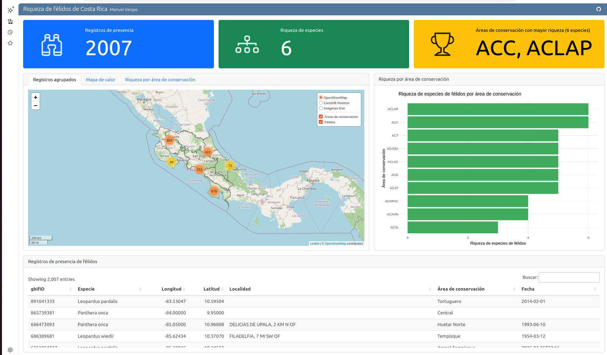

# Tablero de control de riqueza de félidos de Costa Rica

[](https://gf0604-procesamientodatosgeograficos.github.io/2026-i-tablero-riqueza-felidos/)

> 🔗 **[Ver el tablero en vivo](https://gf0604-procesamientodatosgeograficos.github.io/2026-i-tablero-riqueza-felidos/)**

Tablero de control desarrollado con [Quarto Dashboards](https://quarto.org/docs/dashboards/)
que presenta la riqueza de especies de félidos silvestres (familia *Felidae*) en Costa Rica,
con base en registros de presencia de [GBIF](https://www.gbif.org/) y los polígonos de las
áreas de conservación del [SINAC](https://www.sinac.go.cr/).

Es el ejemplo del capítulo *Tableros de control* del libro del curso
**GF-0604 Procesamiento de datos geográficos** (Escuela de Geografía, Universidad de Costa Rica).

## Tablero publicado

<https://gf0604-procesamientodatosgeograficos.github.io/2026-i-tablero-riqueza-felidos/>

## Desarrollo

```sh
# Renderizar el tablero
quarto render

# Vista previa
quarto preview
```

El render local genera la salida en `docs/` (no se versiona). Los conjuntos de datos
están incluidos en este mismo repositorio (carpeta `datos/`) y se cargan con rutas
locales, de modo que el repositorio es **reproducible** por sí solo (código + datos).

## Publicación

La publicación en GitHub Pages es **automática**: al hacer *push* de cambios en `index.qmd`
a la rama `main`, un flujo de trabajo de [GitHub Actions](.github/workflows/publicar.yml)
renderiza el tablero con Quarto y lo despliega. No es necesario renderizar localmente ni
versionar la carpeta `docs/`.
